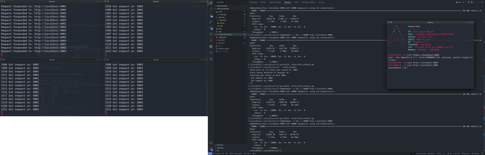
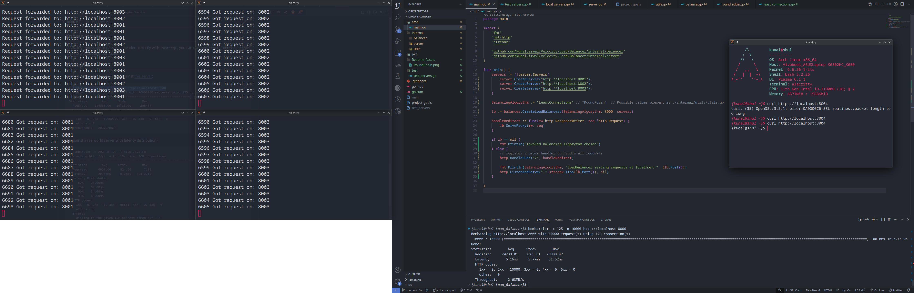

```
####################################################  
#		 _   __    __         _ __      		   #  
#		| | / /__ / /__  ____(_) /___ __		   #  
#		| |/ / -_) / _ \/ __/ / __/ // /		   #  
#		|___/\__/_/\___/\__/_/\__/\_, / 		   #  
#		                         /___/  		   #  
####################################################  
```

# About

This is a project to create a load balancer in Golang that can manage local and global servers and containers named Velocity. It should have Round Robin and Least Connections balancing algorythms and should be configurable via yaml.  
This project was started in my 3rd semester and is an ambitious and a great learning project.  
It currently has Health Checks and removal of servers for if the server is down is configurable via yaml file to route requests to multiple servers for different applications implementing uniquely different balancing algorythms for each one.

# Features of a LoadBalancer:

✅ It should be software based  
✅ It should be written in Golang ( use Go routines for parallelism)  
✅ It should be able to manage all local and global servers and containers  
✅ Lightweight  


## Phase I :Learning Project  
✅ It should be configurable via a config file :Done  
✅ It should have:  
	1) round robin (normal and weighted) :Done   
	2) Least Connections :Done  
✅ Health Checks for if the server is down [ 🚧HTTPS pings or 🚧health endpints or ✅TCP connections ] :Done  
🚧Rate limiting [ IP address and end point ]  
Hot Addition and removal of servers [ ✅Via HealthChecks and 🚧Via REST API interface (we'll see) ]  
🚧Loging and monitoring ( access logs like response times, status codes,... can store into a database like a mongo alpine container)  


## 🚧Phase II :Prod level  
look up auto scaling  
IP blacklisting  
Request queuing  
Request processing time out   
Circuit breaker   
Exponential backoff  
It could also have:  
	1) Sticky Round Robin  
	2) IP/Url Hash  

## 🚧Phase III :Service level  
Dashboard for load visualization or can integrate Prometheus  
Reverse proxy Graceful Shutdown  
Timeouts  


# File structure   
```
Load_Balancer/  
├── cmd/  
│   └── main.go                   # Entry point for the application  
├── internal/  
│   ├── balancer/  
│   │   ├── balancer.go           # Core load balancing logic (round robin, least connections, etc.)  
│   │   ├── round_robin.go        # Different balancing strategies (Round Robin, etc.)  
│   │   └── least_connections.go  # Different balancing strategies (Least Connections, etc.)  
│   ├── config/    
│   │   └── config.go             # Configuration loading and parsing logic  
│   ├── healthcheck/    
│   │   └── healthcheck.go        # Health checking logic for backends  
│   ├── server/  
│   │   ├── server.go             # Server logic, like adding, removing, and selecting servers  
│   │   └── 🚧docker_server.go      # Server handling for Docker containers  
│   │   └── baremetal_server.go   # Server handling for bare metal servers  
│   └── utils/    
│       ├── utils.go			  # Utility functions like Error Handling etc.    
│       └── 🚧logger.go             # Utility functions like logging  
├── 🚧pkg/    
│   └── api/    
│       └── handler.go            # API handler to manage the load balancer (optional)  
├── test/  
│   ├── test_servers.go/                    # A go test server that return 200 status code on /.   
│   ├── sample.env                  # Sample configuration file for the test servers  
│   └── Dockerfile                          # Dockerfile for the test server  
├── config.yaml               # Configuration file for backends, strategies, etc.  
├── go.mod                        # Go module file  
├── go.sum                        # Go dependencies checksum file  
└── README.md                     # Project documentation  
  ```
  
To Run the Load Balancer  

`go run ./cmd/main.go`  
  
For Hot Realoading while development use:  

`CompileDaemon -build="go build -o main ./cmd/main.go" -command="./main"`  

For starting testing server on localhost after creating .env:  

`go run ./test/test_servers.go`  
  
For starting testing server in docker on port 8001:  

`docker run --rm -e PORT=80 -e DURATION=0.1 -p 8001:80 kunalvirwal/go_server`  

For testing the load balancer use:  

`bombardier -c 125 -n 1000 http://localhost:8000`  
  
Tip: To test multi-redirection modify your `/etc/hosts` to have many custom domain names to mimic different services and point them all to Velocity port 8000 at localhost  

# Testing

  

  